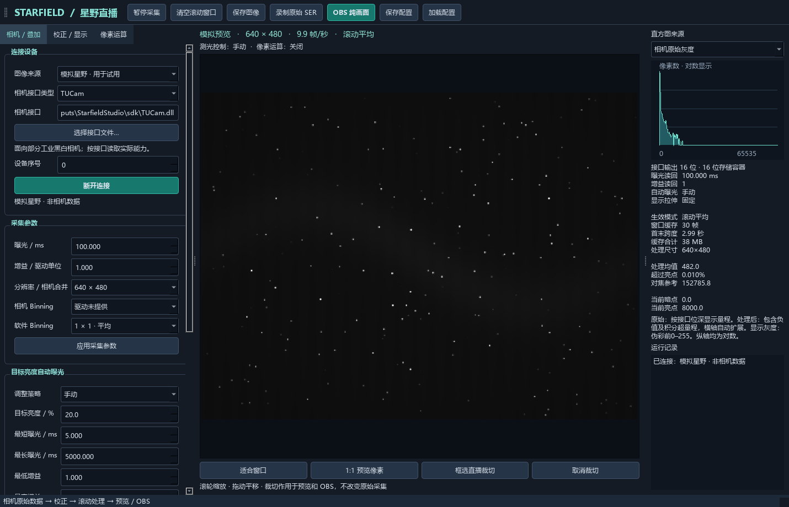

# Starfield Studio

完全Vibe Coding而成的面向部分工业黑白相机的 Windows 实时采集、图像校正和直播工具。支持 TUCam、海康 MVS、图谱 ToupCam 三类原生接口，适用于星野、红外成像及其他黑白实时成像场景。

## 支持范围

| 接口 | 当前实现 | 使用前准备 |
| --- | --- | --- |
| TUCam | 部分明确提供单通道 RAW 位深模式的设备；曝光、增益、分辨率及可用相机 Binning | 安装驱动，选择兼容的 x64 TUCam.dll |
| 海康 MVS | 部分 USB3/GigE 黑白相机；非压缩 Mono8/10/12/14/16；曝光、增益、相机 ROI 画幅 | 安装完整 x64 MVS 开发包，选择 MvImport/MvCameraControl_class.py |
| 图谱 ToupCam | 部分黑白相机；原始 8/10/11/12/14/16 位；曝光、增益和分辨率 | 安装驱动，选择提供 WaitImageV3 的官方 x64 toupcam.dll |

这不是所有型号的兼容承诺。彩色/Bayer、未知格式、海康压缩或 Packed 格式不在本版范围内；未提供标准曝光、增益节点的设备可能无法连接。海康与图谱接口的相机 Binning 当前不开放，均可使用软件 Binning。最长曝光和帧率以设备能力为准。

## 功能

- 暗场、平场、偏置校正
- 关闭叠加、滚动平均、积分、目标亮度自适应叠加和逐像素最大值；窗口可按时间或帧数限制并自动切换模式
- 可选 CPU、GPU（OpenCL）或自动优先 GPU；滚动累加使用 NVIDIA / Intel 的 OpenCL 运行时
- 自动调整：优先曝光时长、优先增益、手动；可分别锁定曝光时间或增益；支持可隐藏的测光选框
- 对数直方图、固定或自动拉伸、裁切与放大
- 预览 / OBS 实时锐化、对比度、Camera Raw 风格参数曲线和可编辑点曲线
- 预览 / OBS 低开销即时降噪：中值 3×3 或高斯 3×3，可调强度
- 预览 / OBS 弱光增强预设：自适应提亮、提亮加轻度降噪、星点／流星保护，可调强度
- 自定义灰度—颜色映射、取色器和渐变
- 按区域及灰度范围执行加法、平均、相减和常用非线性运算
- 独立 OBS 纯画面窗口，等待长曝光时保留最后一帧
- 原始 TIFF / SER、处理后浮点 TIFF / FITS、预览 PNG 和配置保存
- 简约星野镜头图标，已嵌入程序并用于窗口、任务栏和桌面快捷方式

## 运行

运行 `StarfieldStudio-2.6.exe`，保留同目录 `_internal` 与 `sdk`。无需安装 Python。选择接口类型后指定对应官方接口文件，再连接设备。模拟模式无需相机或额外 SDK。

原始帧使用 16 位存储容器，保留接口返回的灰度值；连接后“输入位深”只显示 SDK 明确提供的 Mono8/10/11/12/14/16 模式，切换会重新启动原始采集。较低位深不会被扩充后冒充原生 16 位，原始直方图和测光目标使用实际量程。滚动积分结果是浮点累加，超过单帧上限属于预期，右侧会同时显示原始峰值和处理数据类型；如果单帧原始值越界则立即暂停并提示。

滚动窗口可按时间或帧数二选一。“叠加至目标亮度”会从最近帧向前取最短的积分后缀，使叠加结果的平均亮度达到设定百分比；设定的时间或帧数是上限，窗口不足时使用已有全部帧。最大值模式逐像素保留窗口内的最高值，适合保留星点和流星；亮度触发器在当前窗口内计算平均亮度，支持低于或高于阈值时切换为平均、积分、目标亮度、最大值或单帧。

自动曝光页的“锁定曝光时间（高优先级）”和“锁定增益（高优先级）”会阻止自动曝光改动对应参数；两项都锁定时只测量并保持当前值。配置栏会显示当前保存或加载的配置文件名。

在“最近几秒 · 滚动处理”中可选择“自动（优先 GPU）”“CPU”或“GPU（OpenCL）”。自动模式会优先使用显卡驱动提供的 OpenCL，适配安装了 OpenCL 运行时的主流 NVIDIA 独立显卡和 Intel 核显；找不到运行时或驱动在采集中异常时会显示原因并回退 CPU，同时保留已有滚动窗口。选用 GPU 后，校正、软件 Binning、滚动平均／积分／最大值、像素数学、弱光增强、即时降噪、镜像、对比度、曲线和锐化等可并行的图像处理会走 OpenCL；右侧状态中的“GPU处理 N 次”是实际执行计数。直方图统计、自动曝光测光、伪彩映射、图片编码和相机接口仍由 CPU 完成，这是为了避免频繁的设备来回传输。若显卡驱动未提供 OpenCL，选择 GPU 也会安全回退 CPU。

Windows 任务管理器的“3D”图表不一定显示 OpenCL。请在 GPU 页面切换到对应的“GPU 引擎”或 Compute/OpenCL 图表；软件右侧的 GPU 设备名称和处理计数可用于确认当前采集线程确实在调用所选 GPU。

“校正 / 显示”页的“画面方向”只改变预览、OBS 和预览 PNG，原始 TIFF、SER、FITS 及校正帧仍保留相机原始方向。左侧各大项标题都可以点击折叠，以便在小屏幕上保留更多预览空间。

即时降噪位于“校正 / 显示”页，只作用于预览、OBS 和预览 PNG，不增加滚动缓存，也不改动原始 TIFF／SER／FITS 或处理后浮点文件。中值 3×3 适合孤立热像素，高斯 3×3 适合轻度随机噪声；单像素星点或流星可能被中值滤波削弱，使用最大值模式时建议关闭或降低强度。

弱光增强预设也位于“校正 / 显示”页，只作用于预览、OBS 和预览 PNG。它参考公开的弱光 ISP 处理思路，以当前画面低百分位和高百分位估计黑白点，再做暗部提亮；“弱光提亮 + 轻度降噪”增加一次 3×3 高斯滤波；“星点／流星保护”只在暗部提亮并保持亮点原值。它不是海康臻全彩 2.0 的官方实现：厂商方案还依赖特定镜头、传感器、ISP 和闭源模型，无法从普通输入帧中完整复现。需要时间方向的降噪时，请继续使用滚动平均／积分；追踪流星时可选窗口最大值并降低局部降噪强度。

画面突变、自动增益或手动增益变化不会再悄悄清空有限滚动窗口，因而不会把直播叠加突然变成单帧。窗口仍会按选定的时间或帧数自然移出旧帧；分辨率、相机 Binning、输入位深、校正组合或计算设备变化会清空窗口，因为这些帧的尺寸或数值定义已经不兼容。需要立即重新开始时使用“清空滚动窗口”。增益变化会让过渡期的历史帧与新帧处于不同放大倍率，若要求严格同一曝光标度，可在改变增益后手动清空一次。

详见 [使用说明](使用说明.md) 和 [接口接入说明](SDK接入说明.md)。

## 验证与源码

源码、接口测试和界面测试在 `source`。模拟 SDK 测试覆盖连接、曝光与增益读回、画幅、原始灰度值、拒绝错误格式和关闭释放；模拟采集覆盖处理与 OBS 窗口行为。模拟测试不等同于实机认证。本次没有完成三品牌实机和实际 OBS 推流测试，详见 `验证记录.json`。

厂商运行库及其他依赖遵循各自许可证，见 [第三方说明](第三方说明.txt)。本仓库未声明开源许可证。
